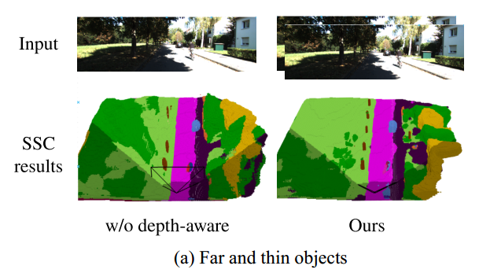
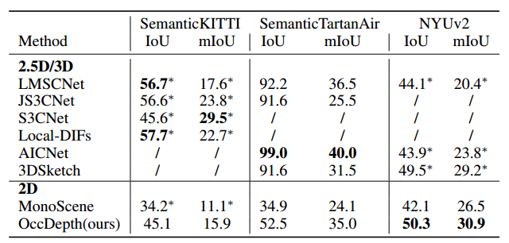

# OccDepth: A Depth-aware Method for 3D Semantic Occupancy Network 


[](https://paperswithcode.com/sota/3d-semantic-scene-completion-on-semantickitti?p=occdepth-a-depth-aware-method-for-3d-semantic)
	
[](https://paperswithcode.com/sota/3d-semantic-scene-completion-on-nyuv2?p=occdepth-a-depth-aware-method-for-3d-semantic)
# News
- **2023/02/28** Initial code. Stereo images and RGB-D images are supported.
- **2023/02/28** Paper released on [Arxiv](https://arxiv.org/abs/2302.13540).
- **2023/02/17** Demo release.

# Abstract
In this paper, we propose the first stereo SSC method named OccDepth, which fully exploits implicit depth information from stereo images (or RGBD images) to help the recovery of 3D geometric structures. The Stereo Soft Feature Assignment (Stereo-SFA) module is proposed to better fuse 3D depth-aware features by implicitly learning the correlation between stereo images. In particular, when the input are RGBD image, a virtual stereo images can be generated through original RGB image and depth map. Besides, the Occupancy Aware Depth (OAD) module is used to obtain geometry-aware 3D features by knowledge distillation using pre-trained depth models.

# Video Demo

Mesh results compared with ground truth on KITTI-08:
<p align="center">

</p>
Voxel results compared with ground truth on KITTI-08:
<p align="center">

</p>
Full demo videos can be downloaded via `git lfs pull`, the demo videos are saved as "assets/demo.mp4" and "assets/demo_voxel.mp4". 

# Results
## Qualitative Results
<div align="center">



Fig. 1: RGB based Semantic Scene Completion with/without depth-aware. (a) Our proposed OccDepth method can detect smaller and farther objects. (b) Our proposed OccDepth method complete road better.
</div>

## Quantitative results on SemanticKITTI

<div align="center">
Table 1. Performance on SemanticKITTI (hidden test set). 

|Method            |Input        | SC  IoU       | SSC mIoU       |
|:----------------:|:----------:|:--------------:|:--------------:|
| **2.5D/3D**      |            |                |                |
| LMSCNet(st)   | OCC        | 33.00          | 5.80           |
| AICNet(st)    | RGB, DEPTH | 32.8           | 6.80           |
| JS3CNet(st)   | PTS        | 39.30          | 9.10           |
| **2D**           |            |                |                |
| MonoScene        | RGB        | 34.16          | 11.08          |
| MonoScene(st) | Stereo RGB | 40.84          | 13.57          |
| OccDepth (ours)  | Stereo RGB | **45.10**      | **15.90**      |
</div>
The scene completion (SC IoU) and semantic scene completion (SSC mIoU) are reported for modified baselines (marked with "st") and our OccDepth.

## Detailed results on SemanticKITTI.
<div align="center">

</div>

## Compared with baselines.
<div align="center">

</div>
Baselines of 2.5D/3D-input methods. ”∗
” means results are cited from MonoScene. ”/”
means missing results

# Usage

## Environment
1. Create conda environment:
``` bash
conda create -y -n occdepth python=3.7
conda activate occdepth
conda install pytorch==1.13.1 torchvision==0.14.1 torchaudio==0.13.1 pytorch-cuda=11.7 -c pytorch -c nvidia
```
2. Install dependencies:
``` bash
pip install -r requirements.txt
conda install -c bioconda tbb=2020.2
```

## Preparing

### SemanticKITTI
- Download kitti odometry and semantic dataset
    - [SemanticKITTI voxel data (700 MB).](http://www.semantic-kitti.org/assets/data_odometry_voxels.zip)
    - [KITTI Odometry Benchmark RGB images (color, 65 GB) and KITTI Odometry Benchmark calibration data  (calibration files, 1 MB)](https://www.cvlibs.net/datasets/kitti/eval_odometry.php)

- Download preprocessed depth
   - [KITTI_Odometry_Stereo_Depth](https://drive.google.com/file/d/1eJPJ1niczagkJfEv21_RdvYBDUbpaQ0w/view?usp=sharing)

- Preprocessed kitti semantic data
    ``` bash
    cd OccDepth/
    python occdepth/data/semantic_kitti/preprocess.py data_root="/path/to/semantic_kitti" data_preprocess_root="/path/to/kitti/preprocess/folder"
    ```


### NYUv2
- Download NYUv2 dataset
    - [NYUv2](https://www.rocq.inria.fr/rits_files/computer-vision/monoscene/nyu.zip)

- Preprocessed NYUv2 data
    ``` bash
    cd OccDepth/
    python occdepth/data/NYU/preprocess.py data_root="/path/to/NYU/depthbin"
    data_preprocess_root="/path/to/NYU/preprocess/folder"
    ```
### Settings
1. Setting `DATA_LOG`, `DATA_CONFIG` in `env_{dataset}.sh`, examples:
    ``` bash
    ##examples
    export DATA_LOG=$workdir/logdir/semanticKITTI
    export DATA_CONFIG=$workdir/occdepth/config/semantic_kitti/multicam_flospdepth_crp_stereodepth_cascadecls_2080ti.yaml
    ```
2. Setting `data_root`, `data_preprocess_root` and `data_stereo_depth_root` in config file (occdepth/config/xxxx.yaml), examples:
    ``` yaml
    ##examples
    data_root: '/data/dataset/KITTI_Odometry_Semantic'
    data_preprocess_root: '/data/dataset/kitti_semantic_preprocess'
    data_stereo_depth_root: '/data/dataset/KITTI_Odometry_Stereo_Depth'
    ```

## Inference

``` bash
cd OccDepth/
source env_{dataset}.sh
## 4 gpus and batch size on each gpu is 1
python occdepth/scripts/generate_output.py n_gpus=4 batch_size_per_gpu=1
```

## Evaluation
``` bash
cd OccDepth/
source env_{dataset}.sh
## 1 gpu and batch size on each gpu is 1
python occdepth/scripts/eval.py n_gpus=1 batch_size_per_gpu=1
```
## Training
``` bash
cd OccDepth/
source env_{dataset}.sh
## 4 gpus and batch size on each gpu is 1
python occdepth/scripts/train.py logdir=${DATA_LOG} n_gpus=4 batch_size_per_gpu=1
```
# License
This repository is released under the Apache 2.0 license as found in the [LICENSE](LICENSE) file.

# Acknowledgements
Our code is based on these excellent open source projects: 
- [MonoScene](https://github.com/astra-vision/MonoScene)
- [SSC](https://github.com/waterljwant/SSC)
- [UVTR](https://github.com/dvlab-research/UVTR)
- [CaDDN](https://github.com/TRAILab/CaDDN)
- [BEVDepth](https://github.com/Megvii-BaseDetection/BEVDepth)

Many thanks to them!

# Related Repos
* https://github.com/wzzheng/TPVFormer
* https://github.com/FANG-MING/occupancy-for-nuscenes
* https://github.com/nvlabs/voxformer

# Citation
If you find this project useful in your research, please consider cite:
```
@article{miao2023occdepth,
Author = {Ruihang Miao and Weizhou Liu and Mingrui Chen and Zheng Gong and Weixin Xu and Chen Hu and Shuchang Zhou},
Title = {OccDepth: A Depth-Aware Method for 3D Semantic Scene Completion},
journal = {arXiv:2302.13540},
Year = {2023},
}
```
# Contact
If you have any questions, feel free to open an issue or contact us at miaoruihang@megvii.com, huchen@megvii.com.

